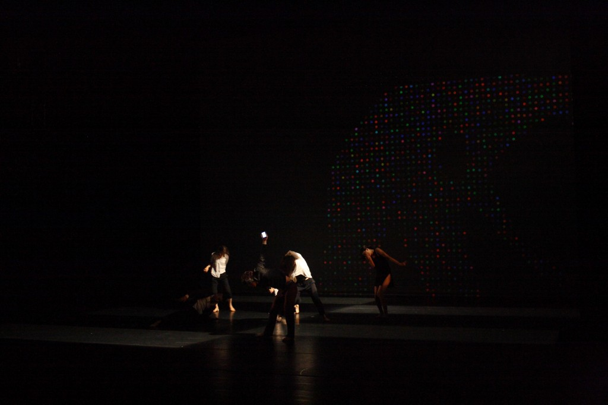
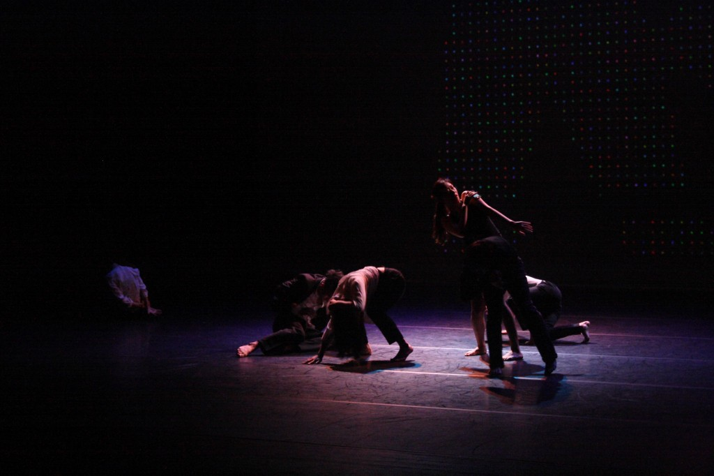

**ADC Project – Don't Imagine** is a new media dance performance. I participated as a multimedia engineer to develop mobile-phone based interactive music controllers for dancers. Here, the dancers did not just follow music; rather, they actively controlled the music while dancing with their mobile phones. The motion of the phone (or, more precisely, the accelerometer values measured) was utilized to apply various sound effects on tape music as well as to show relevant visual effects on screen. 

* Software: Max/MSP, Processing, Don't Imagine app (on iOS, written by me)
* Performed at Arco Art Theater, Seoul, Korea 2011

<iframe width="560" height="315" src="https://www.youtube.com/embed/xUyyWUAm7XA" frameborder="0" allow="accelerometer; autoplay; encrypted-media; gyroscope; picture-in-picture" allowfullscreen></iframe>
