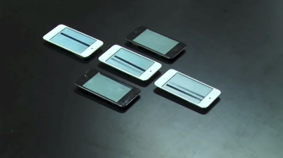

**I.M.Hear** is a tabletop interface with mobile devices. The interface is based on the TAPIR Acoustic Locator (TAL) – a location system for mobile devices using barely audible sound: positions of the mobile devices on the table are tracked down in real time with acoustic signals only. There is a virtual scan line (moving from left to right) on the surface of the table; each device displays part of the scan line when it is "touched" (as shown in the video below) to provide visual feedback to the user.
I participated in this project as a sound designer. Surrounding sounds, such as ambient noise or the users' voice, are recorded through an external microphone and manipulated/re-arranged using Max/MSP to produce their pitch-shifted versions.

* Software: Max/MSP, Processing, I.M.Hear app (on iOS, written by Seunghun Kim)

{:.center}

{:.center}

 

### Demo video
<iframe width="560" height="315" align="middle" src="https://www.youtube.com/embed/clW7ftPLLtA" frameborder="0" allow="accelerometer; autoplay; encrypted-media; gyroscope; picture-in-picture" allowfullscreen></iframe>

 