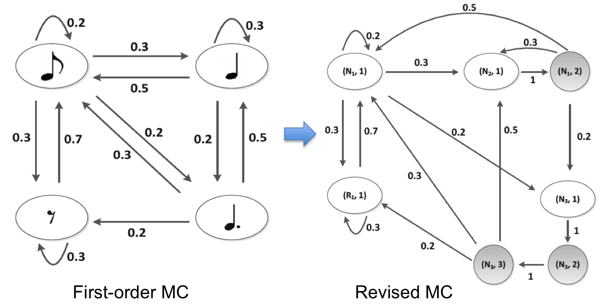
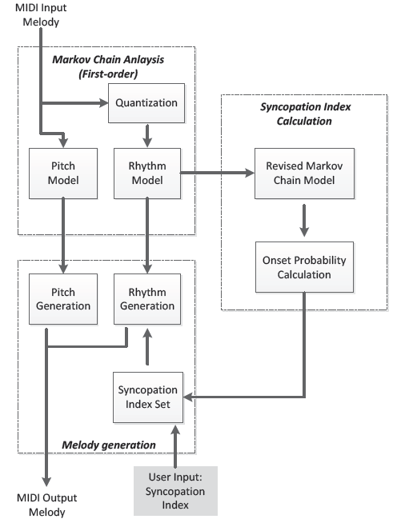
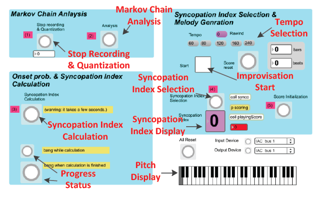

Markov chain models have been widely used to algorithmic composition and machine improvisation. In this paper, we introduce a probabilistic prediction model of rhythmic characteristics of Markov chain-based note sequences. For this purpose, we propose an algorithm to generate a revised Markov chain model and calculate the onset probabilities of notes at each onset position in one measure. As an application of this algorithm, we present an interactive improvisation system which uses a customized syncopation index as an input parameter and allows the user to control the level of syncopation and rhythmic tension in real-time.

{:.center}

{:.center}
Simple Markov Chain (first-order) is converted to Revised Markov Chain to calculate onset probabilities of each note

{:.center}

{:.center}
System overview of the improvisation system

{:.center}

 

### Demo video

{:.center}
<iframe width="560" height="315" align="middle" src="https://www.youtube.com/embed/5ws-9ceg2c4" frameborder="0" allow="accelerometer; autoplay; encrypted-media; gyroscope; picture-in-picture" allowfullscreen></iframe>

This video shows improvisation system with Markov chain analysis, built by Max/MSP. Users are able to control syncopation value in real time.
 

### Related papers:
* Bongjun Kim and Woon Seung Yeo, "Probabilistic Prediction of Rhythmic Characteristics in Markov Chain-based Melodic Sequences," International Computer Music Conference (ICMC) Aug. 2013
 