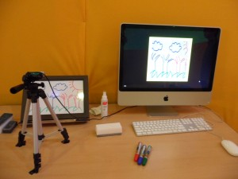
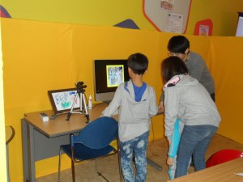
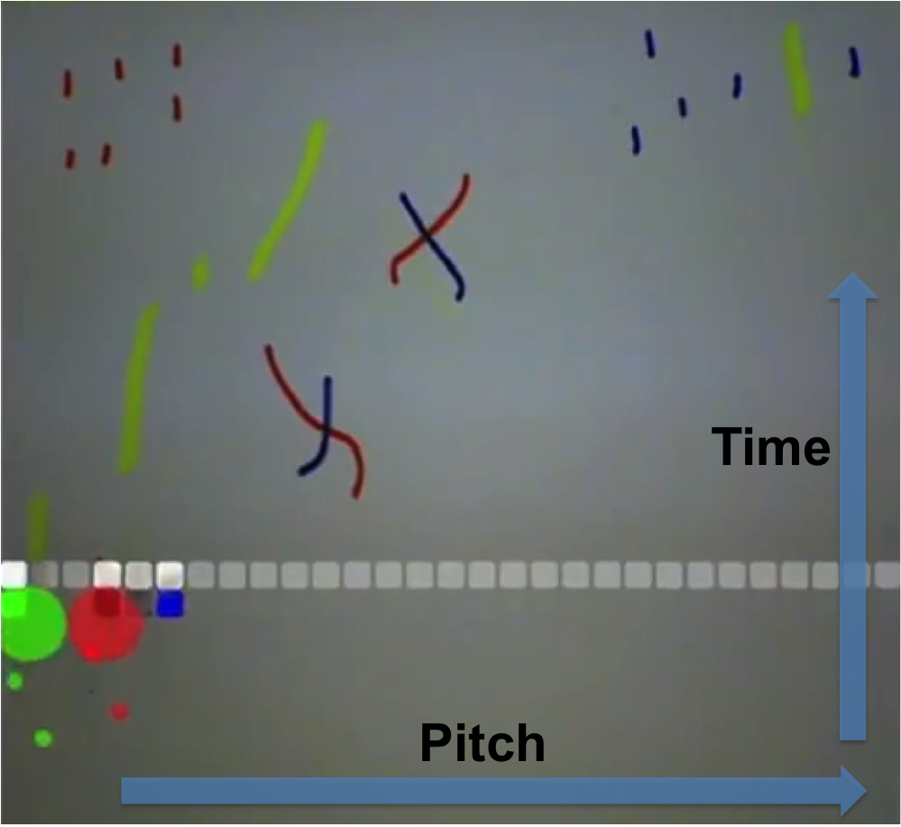
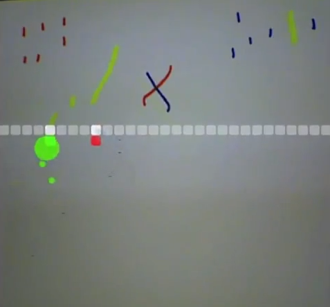

**Turning Into Sound** is an interactive multimedia installation. People can make music by drawing on a white board with three color pens. Horizontal position of the user drawings determines the pitch, while different colors are mapped to different timbres. Parts of the drawings touched by the scan line are converted into relevant sounds, and then disappears on the screen, giving the impression to the user that the drawings "evaporate" into sound.

* Software:  Logic Studio, Processing
* exhibited at Daejeon Children Art Hall, Korea 2012

<!-- 
 -->
<!-- 
 -->

 

### Demo video
<iframe width="560" height="315" align="middle" src="https://www.youtube.com/embed/6TpQ_Uk-BLg" frameborder="0" allow="accelerometer; autoplay; encrypted-media; gyroscope; picture-in-picture" allowfullscreen></iframe>

 