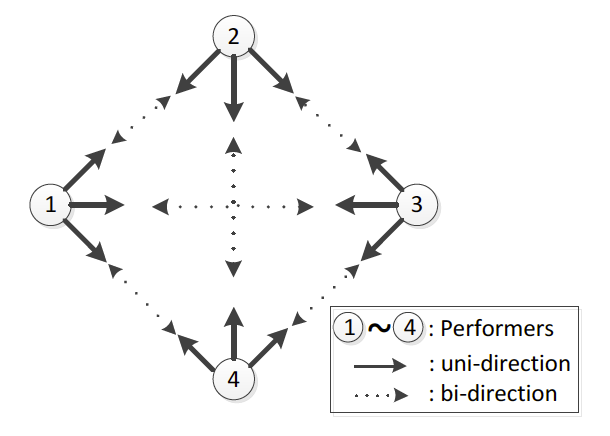
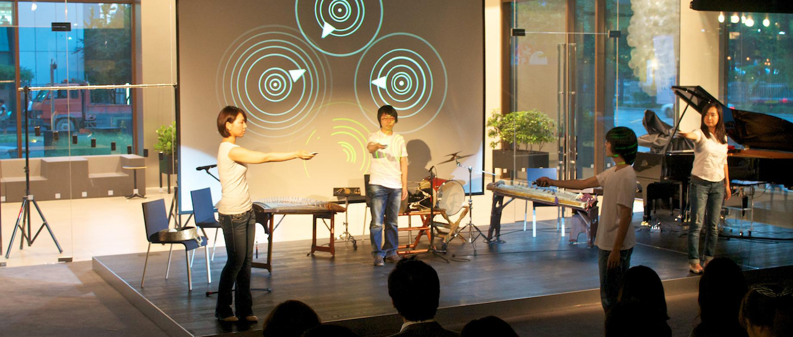
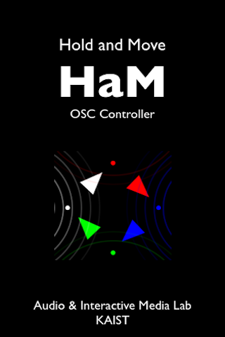
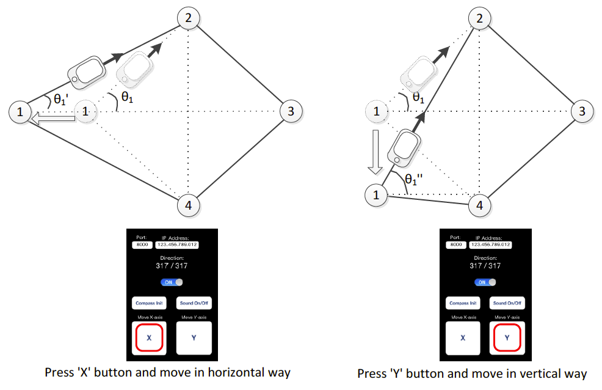
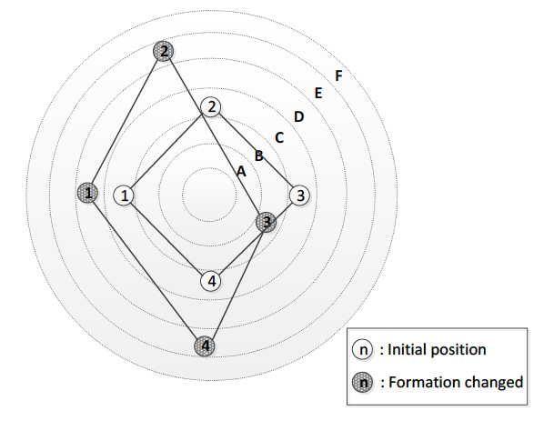

Where Are You Standing? (2011,  2012) is an interactive, collaborative mobile music piece using the digital compass on mobile phones, which is co-composed by me and Woon Seung Yeo. The piece features four performers on stage making sound by taking aim at other performers: compass-measured orientation of each aiming gesture is mapped to a specific musical note depending on which player is aimed at, and is visualized on screen in real-time to show the “music-making” process to the audience.

### Interaction Methods

I presented two cases of compass-based mobile music performance: 1) multiple performers on stage interacting with each other by taking aims, and 2) musical representation of various inter-performer interactions on stage.

1) Case 1: Aiming Direction

Each aiming action of a performer at other is detected as an “event.” For N performers, there are N(N-1) distinct unidirectional events, N(N-1)/2 bidirectional ones, and numerous combinations of those as well that can be used to trigger sound outputs and visual effects.

{:.center}

{:.center}

2) Case 2: Aiming with Movement

The position of each performer can be identified and utilized for more various musical expression. I created iOS app "HaM" to keep track of performers’ positions on stage in real-time.

{:.center}

### Mapping strategies

<iframe width="560" height="315" align="middle" src="https://www.youtube.com/embed/Ts5Ovd0G81c" frameborder="0" allow="accelerometer; autoplay; encrypted-media; gyroscope; picture-in-picture" allowfullscreen></iframe>

Visualization of Changes in on-stage formation of performers. Distances between performers were mapped to inter-Onset interval (IOI).

{:.center}

Depending on the distance from the center of the circle, notes played by the performer get higher pitch

### Performance
Where Are You Standing? 2012 @ NIME 2012 , Ann Arbor, MI, USA.
* Software: Max/MSP, Processing, HaM app (on iOS, written by me)

<iframe width="560" height="315" src="https://www.youtube.com/embed/R2YI03sla3U" frameborder="0" allow="accelerometer; autoplay; encrypted-media; gyroscope; picture-in-picture" allowfullscreen></iframe>
 

Where Are You Standing? 2011 @ Sonic Phone-o-graph, Seoul, Korea.
* Software: Logic Studio, Processing, KAMPO app (on iOS, written by Sihwa Park)
* Each instrument make piano sound as if performers played the piano on taped music.

<iframe width="560" height="315" src="https://www.youtube.com/embed/bMcLfVRlJq8" frameborder="0" allow="accelerometer; autoplay; encrypted-media; gyroscope; picture-in-picture" allowfullscreen></iframe>

#### Related papers:
* Bongjun Kim and Woon Seung Yeo, “Interactive Mobile Music Performance with Digital Compass,” In Proceedings of the International Conference on New Interfaces for Musical Expression (NIME), Ann Arbor, USA, 2012. 
 