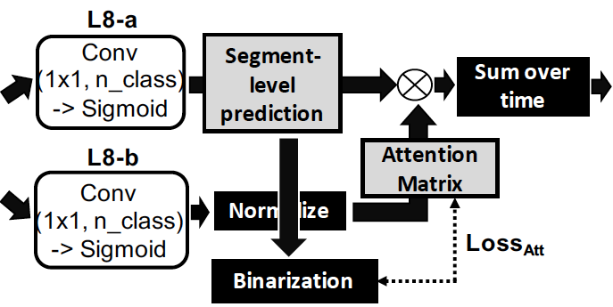

#### [Self-supervised Attention Model for Weakly Labeled Audio Event Classification](https://bongjun.github.io/pages/research.html)
We describe a novel weakly labeled Audio Event Classification approach based on a self-supervised attention model.

 

#### [Improving Content-based Audio Retrieval by Vocal Imitation Feedback](https://bongjun.github.io/pages/research.html)

We describe a novel weakly labeled Audio Event Classification approach based on a self-supervised attention model.

 

#### [Vocal Imitation Set: a dataset of vocally imitated sound events using the AudioSet ontology](https://bongjun.github.io/pages/research.html)

We describe a novel weakly labeled Audio Event Classification approach based on a self-supervised attention model.

 

#### [Lossy Audio Compression Identification](https://bongjun.github.io/pages/research.html)

We describe a novel weakly labeled Audio Event Classification approach based on a self-supervised attention model.

 
 

#### [A Human-in-the-loop System for Sound Event Detection and Annotation](https://bongjun.github.io/pages/research.html)

We describe a novel weakly labeled Audio Event Classification approach based on a self-supervised attention model.

 

#### [Speeding Learning of Personalized Audio Equalization](https://bongjun.github.io/pages/research.html)

We describe a novel weakly labeled Audio Event Classification approach based on a self-supervised attention model.

<!-- We describe a novel weakly labeled Audio Event Classification approach based on a self-supervised attention model. The weakly labeled framework is used to eliminate the need for expensive data labeling procedure and self-supervised attention is deployed to help a model distinguish between relevant and irrelevant parts of a weakly labeled audio clip in a more effective manner compared to prior attention models. We also propose a highly effective strongly supervised attention model when strong labels are available. This model also serves as an upper bound for the self-supervised model. The performances of the model with self-supervised attention training are comparable to the strongly supervised one which is trained using strong labels. We show that our self-supervised attention method is especially beneficial for short audio events.* -->

<!-- [Read more]({{ BASE_PATH }}/pages/research.html)
 -->
 
 

### Improving Content-based Audio Retrieval by Vocal Imitation Feedback
Content-based audio retrieval including query-by-example (QBE) and query-by-vocal imitation (QBV) is useful when search-relevant text labels for the audio are unavailable, or text labels do not sufficiently narrow the search. However, a single query example may not provide sufficient information to ensure the target sound(s) in the database are the most highly ranked. In this paper, we adapt an existing model for generating audio embeddings to create a state-of-the-art similarity measure for audio QBE and QBV. We then propose a new method to update search results when top-ranked items are not relevant: The user provides an additional vocal imitation to illustrate what they do or do not want in the search results. This imitation may either be of some portion of the initial query example, or of a top-ranked (but incorrect) search result. Results show that adding vocal imitation feedback improves initial retrieval results by a statistically significant amount.*

<!-- [Paper ]({{ BASE_PATH}}/pages/files/icassp19_Kim.pdf) -->

 
 

### Vocal Imitation Set: a dataset of vocally imitated sound events using the AudioSet ontology
Query-By-Vocal Imitation (QBV) search systems enable searching a collection of audio files using a vocal imitation as a query. This can be useful when sounds do not have commonly agreed-upon text-labels, or many sounds share a label. As deep learning approaches have been successfully applied to QBV systems, datasets to build models have become more important. We present Vocal Imitation Set, a new vocal imitation dataset containing 11, 242 crowd-sourced vocal imitations of 302 sound event classes in the AudioSet sound event ontology. It is the largest publicly-available dataset of vocal imitations as well as the first to adopt the widely-used AudioSet ontology for a vocal imitation dataset. Each imitation recording in Vocal Imitation Set was rated by a human listener on how similar the imitation is to the recording it was an imitation of. Vocal Imitation Set also has an average of 10 different original recordings per sound class. Since each sound class has about 19 listener-vetted imitations and 10 original sound files, the data set is suited for training models to do fine-grained vocal imitation-based search within sound classes. We provide an example of using the dataset to measure how well the existing state-of-the-art in QBV search performs on fine-grained search.

<!-- [Paper ]({{ BASE_PATH}}/pages/files/icassp19_Kim.pdf) -->

### Lossy Audio Compression Identification
We propose a system which can estimate from an audio recording that has previously undergone lossy compression the parameters used for the encoding, and therefore identify the corresponding lossy coding format. The system analyzes the audio signal and searches for the compression parameters and framing conditions which match those used for the encoding. In particular, we propose a new metric for measuring traces of compression which is robust to variations in the audio content and a new method for combining the estimates from multiple audio blocks which can refine the results. We evaluated this system with audio excerpts from songs and movies, compressed into various coding formats, using different bit rates, and captured digitally as well as through analog transfer. Results showed that our system can identify the correct format in almost all cases, even at high bit rates and with distorted audio, with an overall accuracy of 0.96.

<!-- [Paper ]({{ BASE_PATH}}/pages/files/icassp19_Kim.pdf) -->

### A Human-in-the-loop System for Sound Event Detection and Annotation
Labeling of audio events is essential for many tasks. However, finding sound events and labeling them within a long audio file is tedious and time-consuming. In cases where there is very little labeled data (e.g., a single labeled example), it is often not feasible to train an automatic labeler because many techniques (e.g., deep learning) require a large number of human-labeled training examples. Also, fully automated labeling may not show sufficient agreement with human labeling for many uses. To solve this issue, we present a human-in-the-loop sound labeling system that helps a user quickly label target sound events in a long audio. It lets a user reduce the time required to label a long audio file (e.g., 20 hours) containing target sounds that are sparsely distributed throughout the recording (10% or less of the audio contains the target) when there are too few labeled examples (e.g., one) to train a state-of-the-art machine audio labeling system. To evaluate the effectiveness of our tool, we performed a human-subject study. The results show that it helped participants label target sound events twice as fast as labeling them manually. In addition to measuring the overall performance of the proposed system, we also measure interaction overhead and machine accuracy, which are two key factors that determine the overall performance. The analysis shows that an ideal interface that does not have interaction overhead at all could speed labeling by as much as a factor of four.

<!-- [Paper ]({{ BASE_PATH}}/pages/files/icassp19_Kim.pdf) -->

### Speeding Learning of Personalized Audio Equalization
Audio equalizers (EQs) are perhaps the most commonly used tools used in audio production. The SocialEQ project is a web-based personalized audio equalization system that uses an alternative interface paradigm to the standard approach. Here, the user names a desired effect (e.g. Make the sound 'warm') and teaches the tool (e.g. An equalizer) what settings make the sound embody the term. Social EQ typically requires 25 ratings to properly personalize the equalization settings. In this paper, we present three methods to improve the speed of generating personalized items (audio settings) so users can be provided personalized EQ curves after rating a much smaller number of examples. These methods can be adapted to any situation where collaborative filtering is desirable, the end products created for users are unique and comparable to each other, but prior users did not rate the same set of examples as the current user. Methods are tested on a data set of 1635 user sessions.

<!-- [Paper ]({{ BASE_PATH}}/pages/files/icassp19_Kim.pdf) -->

### IAMHear: A Tabletop Interface with Smart Mobile Devices using Acoustic Location
IAMHear is a novel tabletop interface for music performance and sound making, in which smart mobile devices are used as on-table objects for interaction. Thanks to the advanced features of smart mobile devices, IAMHear is by nature multi-modal and highly interactive. The system also allows for acoustic location mechanism using virtually inaudible sound without any special sensors, making itself simpler in structure and easier to implement. In addition, use of "everyday objects" also evokes interaction by intuitive gestures such as placement, movement, and rotation. As a music sequencer, IAMHear enables the user to make music by placing objects on table; inspired by the idea of spectrographic mapping with virtual scan line, pitch and timbre of sounds are determined by the location/orientation of tabletop objects as well as ambient noise. We present IAMHear as a simple and novel alternative to interactive tabletop interface for music and various multimedia applications as well.

<!-- [Paper ]({{ BASE_PATH}}/pages/files/icassp19_Kim.pdf) -->

### Probabilistic prediction of rhythmic characteristics in Markov chain-based melodic sequences
Markov chain models have been widely used for algorithmic composition and machine improvisation. In this paper, we introduce a probabilistic prediction model of rhythmic characteristics of Markov chain-based note sequences. For this purpose, we propose an algorithm to generate a revised Markov chain model and calculate the onset probabilities of notes at each onset position in one measure. As an application of this algorithm, we present an interactive improvisation system which uses a customized syncopation index as an input parameter and allows the user to control the level of syncopation and rhythmic tension in real-time.

### Interactive Mobile Music Performance with Digital Compass
an interactive, collaborative mobile music piece using the digital compass on mobile phones, which is co-composed by me and Woon Seung Yeo. The piece features four performers on stage making sound by taking aim at other performers: compass-measured orientation of each aiming gesture is mapped to a specific musical note depending on which player is aimed at, and is visualized on screen in real-time to show the “music-making” process to the audience.

<!-- #### <u>Vocal Imitation Set: a dataset of vocally imitated sound events using the AudioSet ontology</u>
*Query-By-Vocal Imitation (QBV) search systems enable searching a collection of audio files using a vocal imitation as a query. This can be useful when sounds do not have commonly agreed-upon text-labels, or many sounds share a label. As deep learning approaches have been successfully applied to QBV systems, datasets to build models have become more important. We present Vocal Imitation Set, a new vocal imitation dataset containing 11, 242 crowd-sourced vocal imitations of 302 sound event classes in the AudioSet sound event ontology. It is the largest publicly-available dataset of vocal imitations as well as the first to adopt the widely-used AudioSet ontology for a vocal imitation dataset. Each imitation recording in Vocal Imitation Set was rated by a human listener on how similar the imitation is to the recording it was an imitation of. Vocal Imitation Set also has an average of 10 different original recordings per sound class. Since each sound class has about 19 listener-vetted imitations and 10 original sound files, the data set is suited for training models to do fine-grained vocal imitation-based search within sound classes. We provide an example of using the dataset to measure how well the existing state-of-the-art in QBV search performs on fine-grained search.*

[Paper ]({{ BASE_PATH}}/pages/publications/icassp19_Kim.pdf) -->

<!-- Note: this is how to write a comment in HTML. Everything in here won't show up on your webpage.-->

<!--
To increase the size of the title, use fewer # in front of the paper title.
To decrease the size of the title, use more #. 
To remove the italics, remove the * before and after the description
To remove the underline from the title, remove the <u> tags (<u> and </u>)
-->